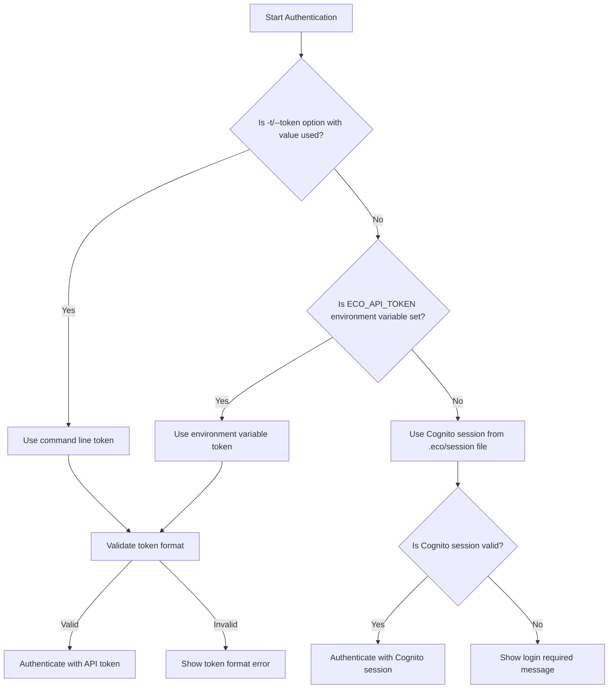
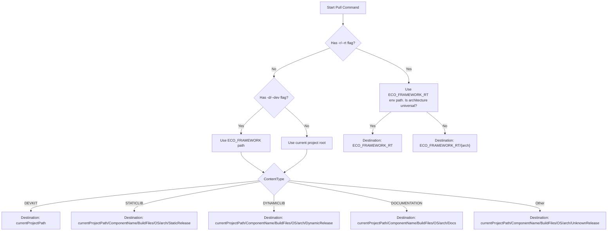
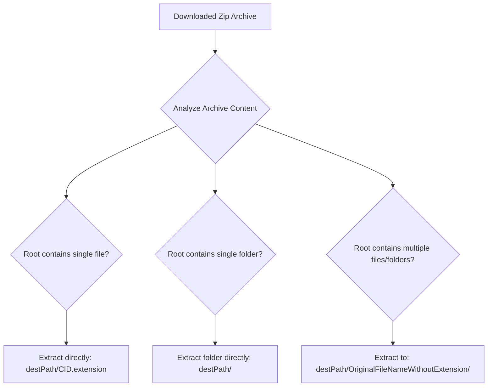
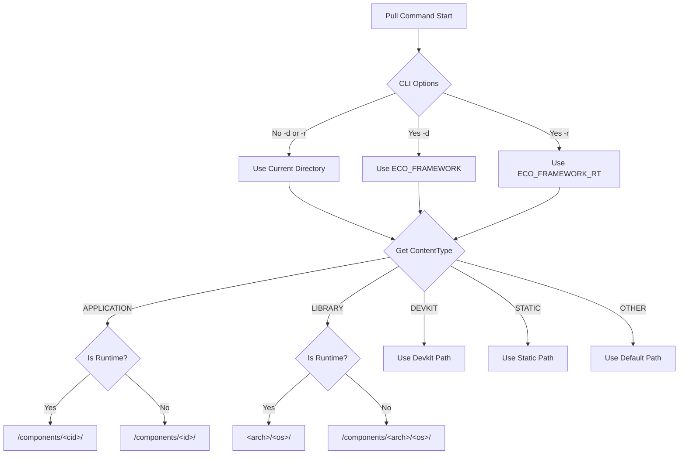

# eco-package
eco-package is a tool to find and download EcoOS ecosystem products from marketplace 'https://ecoos.dev' from terminal, CI pipeline or by AI agent, including Adapted COM (ACOM) components, applications, devkits, libraries, documentation, and etc.

This project uses Quarkus Async Java Framework under the hood.
If you want to learn more about Quarkus, please visit its website: https://quarkus.io/ .

## Eco cli is also used to manage (pull and update) your EcoOS components configuration and can sync it to public Marketplace or with your private registries

## AWS

**! IMPORTANT:**
**AWS library**: check that aws fast download library 'libaws-crt-jni.so/.dylib' (on Windows: 'aws-crt-jni.dll') is available:  

- Для запуска JAR пользователю нужно будет вводить: java -Djava.library.path=. -jar eco-package.jar
- Native-версии (eco-package без расширения .jar) эта библиотека libaws-crt-jni.dylib/.so/.dll нужна обязательно в той же папке.

## Authentication

### Authentication Decision Logic

The eco-package uses a priority-based authentication system with the following decision flow:



### Authentication Priority

1. **--session/-s flag (force Cognito session)**: Highest priority if used - forcefully uses existing Cognito session's access token
2. **Command line token (-t/--token option with value)**: Second priority
3. **ECO_API_TOKEN environment variable**: Third priority
4. **Cognito session tokens (.eco/session file)**: Fallback option

### Force Session Authentication

You can force the CLI to use only the existing Cognito session token (ignoring API token options) by using the `--session` or `-s` flag:

```shell script
eco find -c 58170CB18F454B6F96EBDE437E33987F --session
```

or using the short form:

```shell script
eco pull -c abc123 -v 1.0.0 -s
```

This is useful if you want to ensure the CLI uses your currently authenticated session even if an API token is configured.

### Token-based Authentication

You can authenticate using an API token  (it is obtained from ecoos.dev portal) for faster and more convenient access, including CI/CD use cases.

#### Using Environment Variable

Set the `ECO_API_TOKEN` environment variable (automatically detected):
```shell script
export ECO_API_TOKEN=eco-your-api-token-here
eco find -c 58170CB18F454B6F96EBDE437E33987F
```

#### Using Command Line Option

Pass the token directly using the `-t` or `--token` option (overrides environment variable):
```shell script
eco find -c 58170CB18F454B6F96EBDE437E33987F -t eco-your-api-token-here
```

#### Token Format

Valid tokens must follow this format: `eco-` followed by 48 hexadecimal characters (case-insensitive).

Example of a valid token:
```
eco-1a2b3c4d5e6f7890abcdef1234567890abcdef1234567890
```

### Traditional Cognito Authentication

If you prefer to use traditional login/password authentication:
```shell script
eco login -u myEmail@google.com -p
```

This will authenticate you using AWS Cognito and store session tokens in the `.eco/session` file for future commands.

# the usage is 

# Scan command (alias "info" or "status")

```shell script
eco scan -d

```

or 

```shell script
eco status --rt

```

this will scan you computer for environment and components in development location (-d or --dev flags), specified in the environment variable ECO_FRAMEWORK
-r or --rt flags is looking for EcoOS runtime location, specified in the env variable ECO_FRAMEWORK_RT
default location is current folder


# Login command (alias "sign")

```shell script
eco login -u myEmail@google.com -p 12345678
```
this will authorize a user's session for 1 hour to access the Marketplace registry, where:
user's login after "-u" flag is the user's EcoOS Marketplace portal's login (email) and "-p" is password from Marketplace 

But recommended more secure way below, with interactive password entering. To get prompted for a password, please enter command:

```shell script
eco login -u myEmail@google.com -p
```


# Pull command (alias "get")

```shell script
eco pull -c 58170CB18F454B6F96EBDE437E33987F -v 0.1 -o Windows -a x86-64
```
this will access the registry and pull component with CID=58170CB18F454B6F96EBDE437E33987F
with version=0.1, for: OS=Windows and CPU architecture=x86-64

by default (if these not specified in the command arguments) the command takes OS and Architecture settings, matching you computer OS and CPU architecture

You may also download file from public market by using "-p" flag (by default eco cli searches components only withing your own organization / account)

If you want to pull a certain file you should use "-h" (or --hash=) or "-fid" (--fileId=) option and enter sha256 hash (or fileId respectively) for this file (you can get sha256/fileId in marketplace web portal in a component's file download menu)

```shell script
eco pull -c 58170CB18F454B6F96EBDE437E33987F -h 32aa955e99d428ef4b8b558f6036889b98c6ea2713cfc56366a422319ca54ae5
```

pull file --fileId=973be7922e56 from a component with --id=9c9b3445-63d8-40de-a226-0475e1637a4e in development directory (-d)
```shell script
eco pull -i 9c9b3445-63d8-40de-a226-0475e1637a4e -fid 973be7922e56 -d
```
the order of flags (sub-commands) does not matter

# Update command (alias "upgrade")

The update command checks for newer versions of installed components and updates them from the EcoOS Marketplace registry.

## Bulk Update (All Components)

```shell script
eco update
```
This will check and update **all components** listed in the `ecoPackage.json` file. The command:
- Reads all components from `ecoPackage.json`
- Checks the marketplace for newer versions
- Shows which components have updates available
- Prompts for confirmation before updating
- Downloads and replaces outdated components

## Update Specific Component

```shell script
eco update -c 58170CB18F454B6F96EBDE437E33987F
```
This will update only the specified component with CID=58170CB18F454B6F96EBDE437E33987F from the registry, looking for files matching your computer OS and CPU architecture.

You can also update by internal ID:
```shell script
eco update -i 9c9b3445-63d8-40de-a226-0475e1637a4e
```

## Force Update

```shell script
eco update -f
```
The `-f` (--force) flag overwrites existing component files without prompting for confirmation. Use with care!

## Update in Development/Runtime Directory

```shell script
eco update -d    # Update components in development directory (ECO_FRAMEWORK)
eco update -r    # Update components in runtime directory (ECO_FRAMEWORK_RT)
```


# Find command (alias "search")

this "find" commands looks for components in registry and prints their metadata on screen.

if you know component name you may just run command below:
```shell script
eco find -n eco.list
```
the above command will look for components by name or tags, having "eco.list" substring. The search is made both in public space (published components) and your Organization private workspace

It is possible also to search for individual component by its CID or ID respectively:

```shell script
eco find -c 58170CB18F454B6F96EBDE437E33987F -p
```
this command is searching for components in registry by CID (-u) or ID (-i)
-p is a flag to look for only for published components, otherwise (default) it is searching within your Organization only

```shell script
eco find -i 9c9b3445-63d8-40de-a226-0475e1637a4e
```
the above command will find and print of your Organization's component having --id=9c9b3445-63d8-40de-a226-0475e1637a4e

# Machine-readable output contract (--output=json)

Every command that produces a payload supports the global `--output=json|text` flag.
`json` is selected automatically whenever stdout is not a TTY (piped/redirected);
force text back with `--output=text`. The contract is designed for AI-coder agents
and RAG pipelines (PRD "eco-package improvements"):

- **stdout purity** — in JSON mode stdout carries exactly one result envelope;
  every diagnostic (banner, progress, log line, colour escape) goes to stderr,
  also in text mode.
- **result envelope** — `{"schemaVersion": 1, "command": "...", "ok": true|false,
  "error": null|{...}, "data": ...}`.
- **stable error codes** — `error.code` is one of `NOT_FOUND`, `TRANSIENT_NETWORK`,
  `AUTH_FAILED`, `AUTH_EXPIRED`, `VALIDATION`, `PLATFORM_MISMATCH`, `SERVER_ERROR`,
  `RATE_LIMITED`, with `error.retryable` and `error.retryAfterMs` retry hints.
- **honest exit codes** — `0` only on verifiable success; `1` transient /
  validation / server error; `2` authentication; `3` not found. There is no
  rc=0-with-error path any more (a timed-out query can no longer look like
  "no components found").

```shell script
eco find -n Eco.Math.C89 --output=json 2>/dev/null | jq -r '.data.name'
```

## Catalog listing with pagination

```shell script
eco find -p --output=json                    # complete published catalog as one JSON array
eco find -p --limit 10 --offset 0            # one page + data.nextToken cursor
eco find -p --limit 100 --cursor <token>     # next page via the echoed cursor
```

Every record carries a `productType` (`component`, `kernel`, `application`,
`library`, ...), a repaired `lastVersion` (computed from `versions[]` when the
backend value is broken) and camelCase file fields (`fileId`, `contentType`,
`sha256`, `os`, `architecture`, `extractsAs`).

## Name lookup and full-text search

```shell script
eco find -n Eco.Core1                        # exact, case-insensitive name lookup
eco find -n Eco.Core1 -n Eco.List1           # batch lookup -> {items, notFound}
eco find -q "list"                           # full-text over names, tags, descriptions
```

A single-name match returns one JSON object; several matches return an array.
Zero matches exit with rc=3 and `error.code=NOT_FOUND`.

## Pull with explicit destination and machine receipt

```shell script
eco pull -c 00000000000000000000000000000100 --dest /path/to/project --output=json
```

prints a receipt (`name`, `cid`, `internalId`, `version`, `fileId`, `contentType`,
`sha256`, `extractedPath`, `extractedAs`, `fileCount`, `ecoPackage`), lands files
under `--dest` regardless of the process cwd and ECO_FRAMEWORK, and exits non-zero
when nothing was extracted. `-d <path>` (with a value) is accepted as a legacy
alias of `--dest`; bare `-d` still selects the ECO_FRAMEWORK development directory.

## Dependency closure: eco resolve

```shell script
eco resolve -n Eco.List1 --output=json
```

returns the transitive dependency closure plus the platform-mandatory minimum
stack (Eco.Core1, Eco.InterfaceBus1, Eco.MemoryManager1; Eco.FileSystemManagement1
when file I/O appears in the closure). Each node carries
`{name, cid, resolvedVersion, devkitFileId, depth, requiredBy[], missing}`.
`--package ecoPackage.json` validates/refreshes an existing component set.

## Non-interactive batch install

```shell script
eco install -y --continue-on-error --dest /path/to/project --output=json
```

`-y` installs non-interactively, `--continue-on-error` keeps installing the
remaining components when one fails, and JSON mode prints per-component receipts
plus a summary `{ok, failed, skipped}`.

## RAG corpus export

```shell script
eco export catalog --with-idl --out corpus.ndjson
```

emits one NDJSON record per published product (full profile, all versions with
per-file `fileId`, `contentType`, `sha256`, `size`, `os`, `architecture`,
`extractsAs`, optionally inline IDL content) — the complete catalog, not the
truncated 10-record listing. `--output-format=json` wraps the corpus in the
standard result envelope instead.

## Conformance suite

`scripts/eco_cli_conformance.py` asserts the whole contract (envelope, exit codes,
pagination, receipts, resolve, export, token secrecy, `--help` on every
subcommand) against any eco-package build:

```shell script
python3 scripts/eco_cli_conformance.py --cli "java -jar target/eco-package-<version>-runner.jar"
```

`bin/SKILL.md` is generated from the CLI's own option model with
`scripts/generate_skill_md.py` and documents the machine consumption contract for
coding agents. It is intentionally visible to Git so the generated command and
option documentation is included with each release.

## Breaking changes and migration (machine contract release)

The machine-contract release intentionally fixes dishonest behavior. If existing
scripts relied on the old behavior, migrate as follows:

- **Exit codes are honest now** (PRD R3): `find`/`pull`/`install` return `1`
  (transient/validation), `2` (authentication) or `3` (not found) on failure
  instead of always `0`. Scripts with `set -e` or `cmd || fallback` semantics
  will now observe failures. A genuinely empty result of full-text search
  (`find -q`) still exits 0; an unknown exact name (`find -n`) exits 3.
- **`find -n` is an exact, case-insensitive name match** (PRD R5). Substring
  search moved to `find -q` — use it to enumerate by partial name.
- **`find -p` returns the complete published catalog** (was max 10 records).
  Add `--limit/--offset` if you want pages, and walk `data.nextToken`.
- **Piped output**: when stdout is not a TTY, envelope-capable commands
  (`find`, `pull`, `install`, `resolve`, `export`, `version`) emit the JSON
  envelope; legacy commands (`scan`, `update`, `subscribe`, `login`, `logout`)
  keep their text payload on stdout. Force the old text format with
  `--output=text` anywhere.
- **`pull` of already-present files** without `--force` reports
  `skipped: true` in the receipt with rc=0 (files exist); pass `--force` to
  overwrite. Pull of a missing component exits 3.
- **`eco update`** no longer reports a skipped (already-present) download as a
  successful update; metadata is only rewritten for components that were
  actually downloaded.

# Subscribe command (alias "sub")

The subscribe command allows you to subscribe to components from the EcoOS Marketplace registry. This creates a subscription record linking your organization to the component, enabling you to receive updates and access the component.

```shell script
eco subscribe -c 58170CB18F454B6F96EBDE437E33987F
```

or using the alias:

```shell script
eco sub -i 9c9b3445-63d8-40de-a226-0475e1637a4e
```

this will subscribe your organization to the component with CID (-c) or ID (-i).
The command performs the following:

1. Validates that the component exists and is published
2. Checks that your organization does not already own the component
3. Verifies that no existing subscription exists for your organization
4. Creates a new subscription with proper ownership information

## Required Session Configuration

The SubscribeCommand requires specific user identifiers that must be manually added to the `.eco/session` file. These identifiers are used to populate the subscription record with correct ownership information.

You need to make sure (or manually add) the following properties to your `.eco/session` file:

```properties
userSub=<your-marketplace-cognito-sub-uuid>
userId=<your-marketplace-user-id>
organizationID=<your-marketplace-organization-id>
```

### Obtaining the Required Values

- **userSub**: Your Cognito User's Sub (Subject) identifier. This is a UUID that uniquely identifies your user account in AWS Cognito. You can obtain this from the AWS Cognito Console under your user pool's user details.

- **userId**: Your EcoOS User ID. This is typically available in the EcoOS web portal's user profile or admin panel.

- **organizationID**: Your Organization ID. This is available in the EcoOS web portal's organization settings or admin panel.

### Example Session File

After login, your `.eco/session` file will contain authentication tokens. You must manually add the user identifiers for subscription functionality:

```properties
# Auto-generated after login
AccessToken=<auto-generated-token>
IdToken=<auto-generated-token>
RefreshToken=<auto-generated-token>
TokenTimestamp=<auto-generated-timestamp>

# Required for SubscribeCommand - manually add these
userSub=12345678-1234-1234-1234-123456789abc
userId=user-uuid-from-admin-panel
organizationID=your-org-uuid-here
```

**Note**: The SubscribeCommand validates these properties before attempting to create a subscription. If any are missing, the command will exit with an error indicating which properties need to be added.

# Help command

```shell script
eco --help
```
use -h or --help option to access more commands and details


## Component Pulling Logic

### Destination Path Decision Logic

The eco-package `pull` command determines the destination path for downloaded and extracted components based on several factors:



### Archive Content Impact on Extracted Path

The content of the downloaded component archive affects how files are extracted:



### ContentType Handling

The `ContentType` property of component files determines the subdirectory structure for non-runtime and non-devkit components:

| ContentType | Release Type Folder |
|-------------|---------------------|
| STATICLIB | StaticRelease |
| DYNAMICLIB | DynamicRelease |
| DOCUMENTATION | Docs |
| DEVKIT | (Direct extraction to destination root) |
| Other | UnknownRelease |


#### Content Type Path Patterns

| ContentType | Development Path | Runtime Path | Description |
|-------------|------------------|--------------|-------------|
| APPLICATION | `<basePath>/components/<componentId>/` | `<basePath>/components/<componentId>/` | Application components with unique IDs |
| LIBRARY | `<basePath>/components/<arch>/<os>/` | `<basePath>/<arch>/<os>/` | Architecture and OS specific libraries |
| DEVKIT | `<basePath>/devkit/` | N/A | Development kit components |
| STATIC | `<basePath>/static/` | `<basePath>/static/` | Static content files |
| DEFAULT | `<basePath>/<defaultLocation>/` | `<basePath>/<defaultLocation>/` | Fallback for unknown types |

#### Archive Content Handling

The extraction logic adapts to the type of archive content:

```java
// Component extraction logic snippet
if (entry.isDirectory()) {
    Files.createDirectories(destinationPath);
} else if (isArchiveFile(entry.getName())) {
    extractNestedArchive(inputStream, destinationPath, entry.getName());
} else {
    Files.copy(inputStream, destinationPath, StandardCopyOption.REPLACE_EXISTING);
}

// Special handling for single-file vs. multi-file archives
if (archiveEntryCount == 1) {
    // Single file extraction logic
    if (isDirectoryEntry(firstEntry)) {
        // Extract entire directory
    } else {
        // Extract single file with custom handling
    }
}
```


### Decision Logic Graph



## ecoPackage.json Configuration File

When components are downloaded using the `pull` or `update` commands, the CLI maintains a configuration file named `ecoPackage.json` in the target directory. This file tracks all installed components and their metadata.

### File Format

```json
{
  "name": "my-package",
  "description": "Generated by Marketplace",
  "version": "1.0.0",
  "components": [
    {
      "name": "Eco.InterfaceBus1",
      "cid": "00000000000000000000000042757331",
      "dependencies": []
    },
    {
      "name": "Eco.MemoryManager1",
      "cid": "0000000000000000000000004D656D31",
      "dependencies": []
    }
  ],
  "repositories": []
}
```

### Field Descriptions

| Field | Type | Description |
|-------|------|-------------|
| `name` | String | Package name (default: "my-package") |
| `description` | String | Package description (default: "Generated by Marketplace") |
| `version` | String | Package version (default: "1.0.0") |
| `components` | Array | List of installed components with their metadata |
| `components[].name` | String | Component name |
| `components[].cid` | String | Component ID (CID) - unique identifier |
| `components[].dependencies` | Array | Component's internal dependencies (empty array if none) |
| `repositories` | Array | List of custom repositories (currently empty) |

### Component Metadata

Each component in the `components` array contains:
- **name**: The component's display name
- **cid**: The unique Component ID used for updates and references
- **dependencies**: Array of component's internal dependencies (separate from the root `components` array)

### Notes

- The `ecoPackage.json` file is automatically created and updated by the CLI when using `pull` or `update` commands
- Duplicate components (identified by CID) are automatically prevented
- The file uses atomic write operations to prevent corruption during concurrent access
